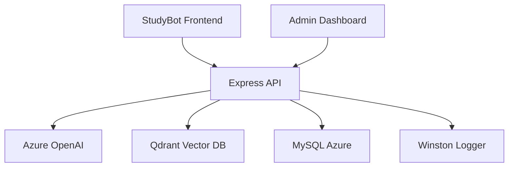

# StudyBot Backend

Backend API pour StudyBot - Chatbot éducatif emlyon business school

## 🚀 Vue d'ensemble

API REST développée en **Node.js + Express + TypeScript** qui fournit :
- **Chat intelligent** avec Azure OpenAI 
- **Recherche vectorielle** avec Qdrant
- **Authentification JWT** pour l'admin dashboard
- **Base de données MySQL** Azure pour le stockage des données
- **Logging avancé** et monitoring

## 📁 Structure du projet

```
studybot-backend/
├── src/
│   ├── config/          # Configuration (env, DB, APIs)
│   ├── controllers/     # Contrôleurs Express (à créer)
│   ├── services/        # Services métier (OpenAI, Qdrant, etc.)
│   ├── models/          # Modèles de données (à créer)
│   ├── middleware/      # Middlewares Express
│   ├── routes/          # Routes API (à créer)
│   ├── utils/           # Utilitaires (logger, etc.)
│   ├── types/           # Types TypeScript
│   ├── database/        # Scripts DB (migration, seed)
│   └── server.ts        # Point d'entrée principal
├── dist/                # Build TypeScript (généré)
├── logs/                # Fichiers de log (généré)
└── package.json
```

## 🛠️ Installation

### Prérequis
- **Node.js** ≥ 18.0.0
- **npm** ≥ 9.0.0
- **MySQL** Azure (à créer)

### Étapes

1. **Installer les dépendances**
```bash
npm install
```

2. **Configurer l'environnement**
```bash
cp .env.example .env
# Éditer .env avec vos vraies credentials
```

3. **Variables d'environnement requises**
```bash
# Azure OpenAI (OBLIGATOIRE)
AZURE_OPENAI_ENDPOINT=https://your-instance.openai.azure.com/
AZURE_OPENAI_API_KEY=your-api-key

# Qdrant (OBLIGATOIRE)  
QDRANT_URL=https://your-cluster.qdrant.tech
QDRANT_API_KEY=your-qdrant-api-key

# JWT (OBLIGATOIRE)
JWT_SECRET=your-super-secret-jwt-key

# MySQL Azure (à configurer lors de la création de la DB)
DB_HOST=your-mysql-server.mysql.database.azure.com
DB_USER=your-username
DB_PASSWORD=your-password
DB_NAME=studybot_db
```

## 🔧 Commandes

### Développement
```bash
npm run dev          # Serveur de développement avec hot-reload
npm run build        # Compiler TypeScript
npm run start        # Serveur de production
```

### Code Quality
```bash
npm run lint         # Vérifier le code avec ESLint
npm run lint:fix     # Corriger automatiquement les erreurs
npm run format       # Formater avec Prettier
```

### Base de données (quand créée)
```bash
npm run db:migrate   # Exécuter les migrations
npm run db:seed      # Peupler avec des données de test
```

### Tests (à implémenter)
```bash
npm test             # Lancer les tests
npm run test:watch   # Tests en mode watch
```

## 🌐 API Endpoints

### Status
- `GET /health` - Health check
- `GET /api/version` - Version de l'API
- `GET /api` - Informations générales

### À implémenter
- `POST /api/auth/login` - Connexion admin
- `POST /api/chat/message` - Envoyer un message 
- `GET /api/admin/stats` - Statistiques dashboard
- `POST /api/admin/feedback` - Gérer les feedbacks

## 🔌 Intégrations

### Azure OpenAI
- **Modèle** : GPT-4 (configurable)
- **Usage** : Génération des réponses du chatbot
- **Monitoring** : Tracking des tokens et coûts

### Qdrant Vector Database  
- **Usage** : Recherche sémantique dans la base de connaissances
- **Collection** : studybot_collection (préexistante)
- **Connexion** : REST API

### MySQL Azure
- **État** : ⚠️ À créer (prochaine étape)
- **Plan** : Standard, France Central
- **Usage** : Sessions, messages, feedbacks, utilisateurs admin

## 🏗️ Architecture



## ✅ État actuel

### ✅ Terminé
- [x] Structure projet TypeScript/Express
- [x] Configuration environnement
- [x] Système de logging (Winston)
- [x] Middlewares sécurité (Helmet, CORS, Rate limiting)
- [x] Gestion d'erreurs globale
- [x] Types TypeScript complets
- [x] Compilation et démarrage fonctionnels

### 🚧 En cours
- [ ] Intégration Azure OpenAI
- [ ] Connexion Qdrant
- [ ] Création base MySQL Azure
- [ ] Authentification JWT
- [ ] Endpoints API chat

### 📋 À faire
- [ ] Dashboard admin
- [ ] Tests unitaires
- [ ] Déploiement Azure App Service
- [ ] Monitoring avancé

## 🔒 Sécurité

- **HTTPS** obligatoire en production
- **Helmet** pour les headers de sécurité
- **CORS** configuré pour les domaines autorisés
- **Rate limiting** (100 req/15min par IP)
- **JWT** pour l'authentification admin
- **Validation** des inputs avec Joi
- **Logging** complet des actions

## 🚀 Déploiement

Le backend sera déployé sur **Azure App Service** (France Central) avec :
- Auto-scaling selon la charge
- SSL/TLS automatique  
- Variables d'environnement sécurisées
- Monitoring Application Insights

## 📊 Monitoring

### Logs
- **Fichier** : `logs/studybot.log` (production)
- **Console** : Mode développement
- **Niveaux** : error, warn, info, debug

### Métriques suivies
- Temps de réponse OpenAI
- Utilisation tokens/coûts
- Erreurs et exceptions
- Requêtes par endpoint
- Sessions utilisateurs

## 🔧 Développement

### Ajout d'une nouvelle route
1. Créer le contrôleur dans `src/controllers/`
2. Ajouter les types dans `src/types/`
3. Créer la route dans `src/routes/`
4. Importer dans `server.ts`

### Ajout d'un service
1. Créer le service dans `src/services/`
2. Ajouter la configuration si nécessaire
3. Ajouter les types correspondants
4. Utiliser dans les contrôleurs

## 📞 Support

Pour toute question technique :
- Vérifier les logs : `tail -f logs/studybot.log`
- Health check : `curl http://localhost:3001/health`
- Variables env : Vérifier `.env` vs `.env.example`

---

**Prochaine étape** : Créer la base de données MySQL Azure et implémenter les services OpenAI/Qdrant. 